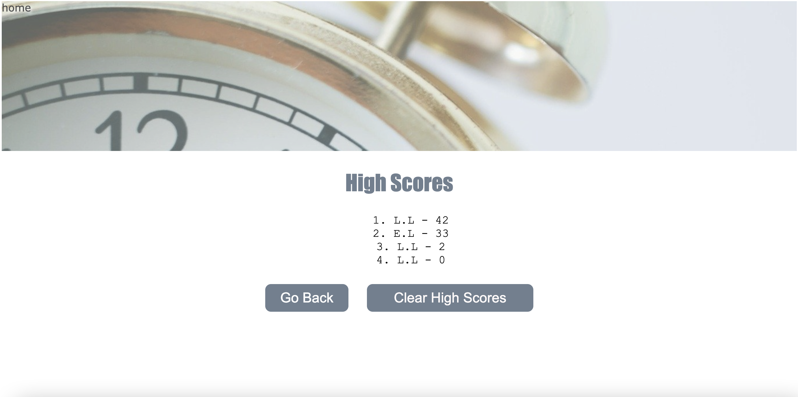

# Coding Quiz Challenge

## Description

This is a code-related quiz challenge webpage. The users are expected to finish five questions within 50 seconds. Each incorrect answer will deduct 10 seconds. The quiz will start as soon as the users click on the "START" button, and the timer will start count down. The users are requested to input their initial when the quiz is completed. The webpage will store the initials and scores until the users clear out the results. The users will be able to go back to the quiz and replay by choosing "go back" button or "home"nav on the left top side of the page. The users can practice the quiz over and over to improve their speed and reinforce the knowledge of coding.
Enjoy and have fun!

## Table of Contents

* [Installation](#Installation)
* [Usage](#Usage)
* [Websites](#Websites)
* [Credits](#Credits)

## Installation

1. clone the code from github.
2. download the files into your computer.
3. ready to use.

## Usage

Users can access view high scores by clicking the link on left top side of page. 
Users will start quiz challenge as soon as click on the "START" button.
The timer will start count down from 50 to 0. Each incorrect answer will deduct 10 seconds from final score.
Users will be able to store the initials and final scores on the second page.
Users will be able to go back to the quiz page by click on "go back" button or click on "home" nav on the left top side of the page.
Users will be able to keep their records in the order of highest scores until clear out the history by click on "clear high scores."

The following image demonstrates the web application's appearance and functionality:

## Websites

 https://flowingcityloy.github.io/Coding-Quiz-Challenge/ (Links to an external site.)

https://github.com/flowingcityloy/Coding-Quiz-Challenge

## Credits

❤️ Made with love by Lydia Loy ❤️